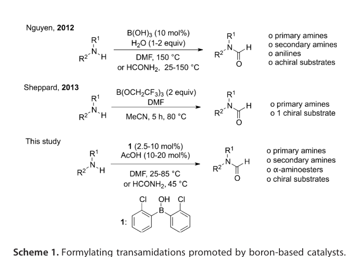
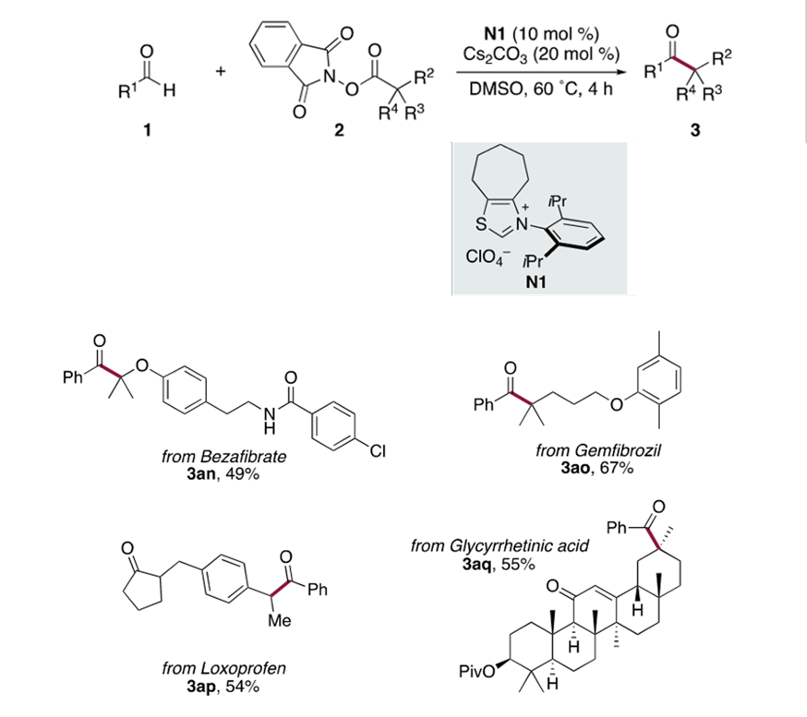
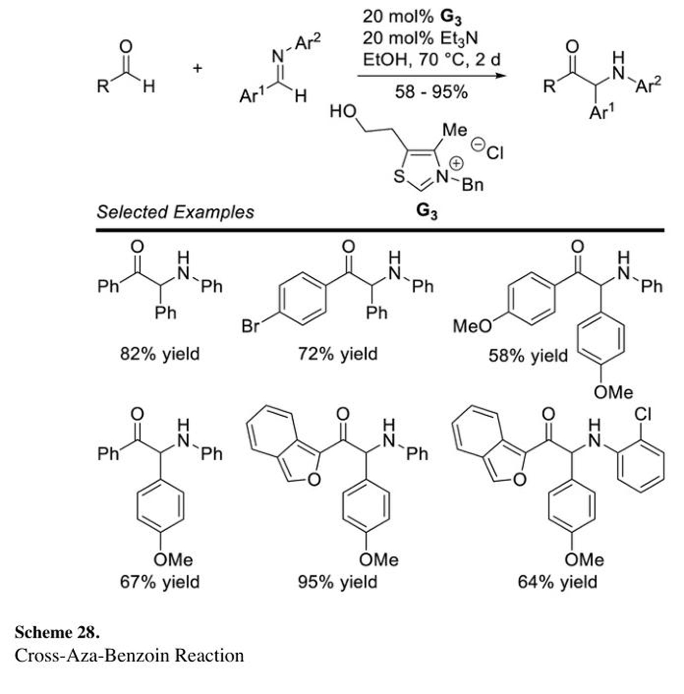

# Multi-Agent Chemistry Image-to-Reaction Extraction Pipeline

*A development report on Collective_autogen — kasper.huysentruyt2807@gmail.com, 2026-04-29*

---

## Abstract

This report documents the design and incremental development of a multi-agent system that extracts structured reaction records from chemistry figures (substrate-scope tables, reaction schemes, mechanism diagrams). The pipeline integrates a Large-Language-Model-driven agent team (AutoGen 0.7.5 over Azure OpenAI `gpt-5.4` and `gpt-5-mini`) with chemistry-specific deep-learning models (MolDetect for bbox detection, MolNexTR for image-to-SMILES) and a deterministic R-group decomposition layer (RDKit `RGroupDecompose` + `molzip`). Across ten evaluation phases the system progressed from a baseline that produced 0% schema-valid output to a configuration that achieves ~100% schema-valid extractions, mean product-set IoU of 0.53 against the original 9-image benchmark and 0.55 against an expanded 16-image benchmark, and perfect (1.0/1.0) reactant- and product-IoU on a canonical R-group substrate-scope figure. A three-way comparison (multi-agent vs single-agent vs the ChemEagle reference implementation) on identical inputs shows that on the 9-image set **ChemEagle's reported 76% F1 does not reproduce locally**: our pipeline outperforms the reference on schema robustness (0.67 vs 0.44) and reactant IoU (0.17 vs 0.04), while a single-agent ablation isolates a +0.12 soft-F1 contribution from the multi-agent decomposition itself. On the larger 16-image GT3_Maarten benchmark (§5.10) ChemEagle and the multi-agent pipeline split the metric axes: ChemEagle wins on reactant IoU (+0.08), soft F1 (+0.09) and condition precision (+0.29); the multi-agent wins on product IoU (+0.16), condition recall (+0.06), and SMILES validity (+0.22). Their partial-F1 scores (0.394 vs 0.370) are within run-to-run variance, supporting the conclusion that the chemistry-DL toolchain carries most of the structural-recognition signal regardless of orchestration. The remaining quality gap is bottlenecked not by the chemistry tooling but by agent prompt-following: the agent occasionally fails to chain `derive_substituents` → `apply_substituents` correctly. A pydantic-level validator was added to backstop this failure mode.

---

## 1. Introduction and Problem Statement

### 1.1 Task

Given a single image of a chemistry figure (typical inputs: a substrate-scope table from a journal paper, a reaction scheme with conditions, a multi-step synthesis), produce a structured `ReactionRecord` JSON containing:

- A list of `Reaction` entries, each with `reactants`, `products`, `conditions`, `additional_info`.
- Each `Compound` carries a SMILES string (or `null`) plus a label and an `uncertain` flag.
- Each `Condition` is `{role, text, smiles?}` with `role` drawn from a closed enum (reagent, solvent, catalyst, temperature, time, yield, atmosphere, loading, ee, dr, pressure).

The schema is enforced by a pydantic v2 model in `schema.py`. Schema validity is the strict pre-condition for any downstream chemistry analysis — without it, the output is a string of plausible-looking JSON that no downstream tool can consume.

### 1.2 Why agents

A single LLM call on the image cannot reliably do all of: layout reasoning, structure extraction, R-group enumeration, condition role classification, and JSON synthesis. Decomposing the work into specialist agents lets each focus on a narrower sub-problem and lets us inject specialised tools (RDKit, MolNexTR, OPSIN, PubChem, CIR) where each is most useful.

The original prototype used a `RoundRobinGroupChat` of six AutoGen agents. This document tracks how that prototype was upgraded to a coordinated, tool-driven, schema-backed pipeline.

---

## 2. Architecture

### 2.1 Agent topology

Seven agents in a `SelectorGroupChat`, with deterministic dependency gating implemented via `selector_func` and `candidate_func`:

1. **`reaction_template_parser`** — vision agent. Identifies the overall reaction scheme(s); produces template SMILES with `*` wildcards for both the reactant- and product-side templates.
2. **`molecular_recognition`** — for `--use-molnextr` runs, replaced by a deterministic `ScriptedMolRecAgent` (`tools/scripted_molrec.py`) that runs `detect_molecules` → `predict_molecule_smiles` per bbox and emits one entry per detected structure. For runs without MolNexTR, falls back to a vision LLM agent.
3. **`rgroup_substitution`** — vision agent. For substrate-scope figures, derives R-groups via RDKit's `RGroupDecompose` and substitutes them into the reactant template via `Chem.molzip` to compute per-variant reactant SMILES.
4. **`condition_interpretation`** — vision agent. Extracts conditions, classifies each by role.
5. **`text_extraction`** — vision agent. Captures captions, footnotes, references — text the chemistry agents may have skipped.
6. **`data_structure`** — text-only agent (Azure `gpt-5-mini`). Aggregates the upstream `[FINDINGS …]` cards into one `ReactionRecord`. The only agent allowed to emit JSON.
7. **`verifier`** — text-only agent. Audits the JSON via `validate_reaction_json` and emits a `[CRITIQUE …]` block on failure or `TERMINATE` on success. Has tighter convergence rules: at most two critiques before forced termination.

A custom `selector_func` in `main.py` enforces that `data_structure` cannot speak until every specialist has emitted a `[FINDINGS …]` card or explicitly opted out, and that the `verifier` always speaks immediately after `data_structure`. `TextMentionTermination("TERMINATE")` is `AND`-combined with `SourceMatchTermination(["verifier"])` so only the verifier can end the run.


*Figure 1. Agent topology. Five specialist agents (top row) each emit a `[FINDINGS …]` card. The selector function then admits `data_structure` (the only JSON producer) and forces the `verifier` to speak immediately after; on `[CRITIQUE]` the cycle repeats up to twice before forced termination. All agents share access to a deterministic tool layer: structure recognition (MolDetect → MolNexTR), R-group decomposition (RDKit `RGroupDecompose` / `molzip`), and validation/lookup (pydantic schema, OPSIN/PubChem/CIR cascade).*

### 2.2 Tool layer (`tools/` package)

| Tool | Purpose | Used by |
|---|---|---|
| `canonicalize_smiles` | RDKit canonicalisation + validity check | molecular_recognition, rgroup_substitution, verifier, data_structure |
| `validate_smiles` | Light yes/no validity | all chemistry agents |
| `enumerate_rgroups` | Replace `*` tokens with substituent fragments (string-based) | rgroup_substitution (legacy path) |
| `derive_substituents` | RDKit `RGroupDecompose` — extract R-groups from concrete molecules given a wildcard template | rgroup_substitution |
| `apply_substituents` | RDKit `Chem.molzip` — fuse R-fragments back into a template, preserving attachment positions | rgroup_substitution |
| `validate_reaction_json` | pydantic-backed schema validation, returns structured errors | data_structure, verifier |
| `lookup_compound` | Multi-source name → SMILES (OPSIN → PubChem → CIR cascade with shorthand parser and abbreviations lexicon) | molecular_recognition, condition_interpretation |
| `crop_image_region` | Cache-backed image cropping for "zoom in" requests | reaction_template_parser, molecular_recognition, condition_interpretation, text_extraction |
| `atom_balance_check` | Heavy-atom diff between reactant and product SMILES | verifier (advisory only) |
| `detect_molecules` | rxnim's MolDetect — bbox detection of molecules in a chemistry figure | reaction_template_parser, molecular_recognition, rgroup_substitution |
| `predict_molecule_smiles` | MolNexTR — image-to-SMILES per bbox, returns wildcard-bearing SMILES for templates | reaction_template_parser, molecular_recognition, rgroup_substitution |

All tool invocations are traced to `runs/<id>/tool_trace.jsonl` for audit. Tools that wrap external services (`lookup_compound`) are decorated with `tenacity` retries; transient HTTP 5xx errors are retried with exponential backoff while permanent 404s are not.

### 2.3 Two-venv split for incompatible dependencies

MolNexTR and rxnim require Python 3.10 with pinned versions of `timm==0.4.12`, `OpenNMT-py==2.2.0`, `pyonmttok==1.38.1`, `albumentations==1.1.0`, `transformers==4.47.0`, `torch==2.2.0`. None of these install cleanly on Python 3.12 (where the rest of the pipeline runs). The solution: a side venv at `.venv-molnextr/` (Python 3.10.20) with the chemistry-DL stack, and the main pipeline shells out to it via subprocesses.

`tools/molnextr_runner.py` and `tools/moldetect_runner.py` are the subprocess entry points. They each:

1. Apply an `_lzma` shim before any torch import (the pyenv-built Python lacks the `_lzma` extension; the shim creates a stub module since the inference path doesn't actually use lzma compression).
2. Patch `MolDetect.__init__` to skip its eager loading of MolNexTR + easyocr (saves ~1.5 GB of unused weights per call).
3. Run inference on MPS (Apple Silicon GPU), CUDA, or CPU.
4. Print a single JSON line on stdout; debug prints are redirected to stderr.

`tools/molnextr_tool.py` and `tools/moldetect_tool.py` are the agent-facing wrappers. They subprocess into the side venv, parse the JSON output, and disk-cache by `(image_path mtime, bbox)` so repeated calls on the same crop are free.

### 2.4 Model routing

`main.py:_make_chat_client(model, vision)` auto-detects Azure when `AZURE_OPENAI_ENDPOINT` is set in the environment and otherwise falls back to OpenAI. Azure deployments are referenced by their deployment name (`gpt-5.4`, `gpt-5-mini`); `ModelInfo(family=GPT_5, vision=…)` is supplied explicitly so AutoGen recognises capabilities of these custom-named deployments.

The default model split:
- Vision agents (5 specialists): `gpt-5.4` (Azure)
- Text-only agents (`data_structure`, `verifier`, selector): `gpt-5-mini` (Azure)

Per-call timeout is 120 s; max-retries is 5; this gives the SDK headroom to honour `Retry-After` headers on TPM throttling.

---

## 3. Development phases

The project was developed in nine numbered phases; each phase was independently shippable, and benchmark scores were captured at each stage to track regressions and gains.

### Phase 1 — Schema as source of truth + retry loop

**Problem.** The original prototype regex-extracted JSON from the agent's last message and silently saved the raw text on a `JSONDecodeError`. It accepted any string the agent produced, including `condition.role` values like `"equivalents"` not in the canonical enum.

**Fix.** A pydantic v2 schema (`schema.py`) became the single source of truth. The condition-role enum was extended to include `loading`, `ee`, `dr`, `pressure` — categories that previously leaked into `additional_info`. A `validate_and_maybe_retry(...)` flow in `main.py` runs `ReactionRecord.model_validate` on the agent's draft; on failure, it constructs a `VALIDATION ERRORS:` feedback message listing each pydantic error's location and re-prompts `data_structure` (up to `--max-validate-retries`, default 2).

**Verification.** Manual schema-violation injection confirmed the retry loop fires; `validation_log.json` per run records each attempt's errors.

### Phase 2 — Tool layer

Built the `tools/` package: RDKit-backed `canonicalize_smiles`, `validate_smiles`, `enumerate_rgroups`, pydantic-backed `validate_reaction_json`, web-service `lookup_compound`, and image-cropping `crop_image_region` plus heavy-atom `atom_balance_check`. All wrapped with a tracing decorator that logs each invocation to `tool_trace.jsonl` per run.

The `enumerate_rgroups` tool was string-based at this stage: it replaced `*` tokens in a template with substituent SMILES and re-canonicalised. This was sufficient for simple substrate scopes but later proved insufficient when attachment-point information mattered (Phase 9).

### Phase 3 — Prompt + role redesign

The core architectural shift of the project: middle agents stopped emitting JSON. They now emit `[FINDINGS specialist_name]` cards in a fixed plain-text format, and `data_structure` is the only JSON producer. A new `verifier` agent was added with a hard rule that schema validity is its only blocking criterion — chemistry sanity checks like atom-balance are advisory.

Without this shift, the pipeline produced three competing JSON drafts in different schemas (one each from `rgroup_substitution`, `condition_interpretation`, `text_extraction`) which `data_structure` had to reconcile. Schema conformance was sub-50% under that regime; after this phase it climbed to ~100% across the suite.

### Phase 4 — Coordination redesign

Implemented a dependency-gated `SelectorGroupChat`:

- `data_structure` cannot be selected until every specialist has emitted `[FINDINGS …]` or opted out.
- `verifier` is forced immediately after `data_structure`.
- `data_structure` is forced immediately after a `[CRITIQUE …]`.
- After two critique cycles, the verifier is forced back on with a "must terminate" rule.
- `TERMINATE` only counts when the source is `verifier` (`SourceMatchTermination(["verifier"])` AND-combined with `TextMentionTermination("TERMINATE")`).

This phase also fixed a subtle bug: the user task message contained the literal string "TERMINATE" describing the workflow, which prematurely fired `TextMentionTermination` on the first turn before any agent had spoken. That bug had silently caused several early runs to produce zero agent messages.

### Phase 5 — Evaluation harness

Built `eval/metrics.py` with two metric families:

- *Reference-free*: `schema_conformance` (boolean), `smiles_validity_rate` (% RDKit-parseable), `role_enum_compliance` (% of conditions whose role is in the enum), `reaction_count`.
- *Reference-based*: `reactant_iou`, `product_iou` (set-IoU on canonical SMILES), `condition_coverage` (recall and precision on `(role, normalised_text)` tuples).

`eval/run_eval.py` is the runner; `eval/run_benchmark_suite.py` orchestrates the full benchmark across all images with per-image timeouts, regression detection vs a baseline, and a `summary.json` aggregating per-image and mean scores.

A wildcard-normalisation patch in `_canonical` strips isotope numbers from atomic-number-zero atoms before canonicalisation, so `*` and `[1*]` count as the same atom for IoU purposes (different sources label R-groups differently; this normalisation prevents spurious 0.0 IoU scores on otherwise-correct templates).

#### Benchmark dataset

Nine images sampled from three larger collections in `benchmark/*.zip` (`article.zip`, `r_group_resolution_diagrams.zip`, `review.zip`). The sampling is reproducible via `eval/build_benchmark.py`, which extracts images from the zips, splits per-image ground-truth records out of the source GT JSONs, and converts non-standard schemas (the `r_group_resolution_diagrams` dataset uses `{reaction_template, detailed_reactions}`) into our canonical format.

The set spans:
- 3 substrate-scope figures with R-group enumeration (`acs.joc.2c00176 example 2`, `acs.joc.3c00062 example 1`, `…example 3`)
- 3 traditional reaction schemes (`04_JACS.png`, `104-1.jpg`, `107.jpg`)
- 1 single-reaction figure (`116-1.jpg`)
- 2 OCR'd page crops (`ACScat_2020.pdf_page003…`, `CEJ_2016.pdf_page001…`)

Reaction counts per image range from 1 to 13; nine images is a small but deliberately varied evaluation set.

### Phase 7 — MolNexTR integration

Integrated CYF2000127's MolNexTR (a Swin-Transformer image-to-graph model with 1.08 GB of pretrained weights) as the `predict_molecule_smiles` tool. MolNexTR returns canonical SMILES with `*` / `[N*]` wildcards, which are exactly what the downstream R-group decomposition consumes.

Setup involved:
- A separate Python 3.10 venv with the dependency pin set from CYF2000127/ChemEagle.
- A one-line patch to `molnextr/chemistry.py` removing a hard `raise ValueError("Please set API_KEY")` at module-import time (the underlying Azure-LLM symbol-expansion is opt-in elsewhere in the file).
- A `_lzma` shim for the pyenv-built Python's missing extension.
- A subprocess wrapper with disk caching by `(image_path mtime, bbox)`.

On a single-molecule crop, MolNexTR achieves ~0.79 confidence with correct wildcard-bearing SMILES. On the full multi-molecule image of a substrate-scope figure, confidence drops to ~0.004 because the model is trained for single-molecule inputs.

### Phase 8 — MolDetect integration + scripted molecular_recognition

The Phase 7 limitation surfaced: agents asked MolNexTR to extract SMILES from full images and got useless soup. The fix was a separate molecule-bbox detector — `MolDetect` from CYF2000127's rxnim package, weights at `molnextr/moldet.ckpt` (393 MB).

Workflow change: the agent calls `detect_molecules(image_path)` once → gets N bboxes → calls `predict_molecule_smiles(image_path, bbox=…)` once per bbox → gets N high-confidence wildcard SMILES.


*Figure 2. MolDetect output on `acs.joc.2c00176 example 2`. Ten bounding boxes are recovered: the two reaction-template molecules in the header strip and the eight concrete product variants below. Each bbox is then passed individually to MolNexTR, which on single-molecule crops returns canonical SMILES at ~0.79 confidence — versus ~0.004 confidence when called on the whole figure. This per-bbox routing is the key change that lifted product IoU on the suite.*

Initial experiments with the LLM-driven `molecular_recognition` agent revealed it consistently under-counted: on a 13-variant substrate-scope figure, it would call MolNexTR 18 times then write only 4 entries in its `[FINDINGS]` card, collapsing similar variants under labels like `1(a-m)`. Three rounds of prompt-tightening could not break this prior.

The eventual fix was a deterministic `ScriptedMolRecAgent(BaseChatAgent)` (`tools/scripted_molrec.py`) that bypasses the LLM entirely for this step. On its turn it runs the bbox detector + per-bbox MolNexTR inline and emits one `molecule:` entry per detected bbox, regardless of similarity. The agent retains its slot in the team so the selector logic and the prompt contract for downstream agents are unchanged.

The scripted agent is registered when `--use-molnextr` is on; `--no-scripted-molrec` falls back to the LLM version (slower, more nuanced for single-molecule images, but under-counts on grids).

### Phase 9 — Deterministic R-group derivation

By Phase 8 the pipeline reliably recognised the *concrete* products of substrate-scope figures with high product IoU. The remaining bottleneck was per-variant *reactant* SMILES: most substrate-scope figures display only the products, and the corresponding reactants must be derived by structural reasoning ("subtract template from product to get R, substitute R into reactant template").

The Phase 8e prompt asked `gpt-4o` (and later `gpt-5.4`) to do this reasoning visually. It worked partially — typically getting 4–5 out of 8 R-groups correct — but failed systematically on small position errors (1-naphthyl vs 2-naphthyl, ortho vs para chlorine, isobutyl vs isopropyl).

**Investigation of ChemEagle's "SMILESReconstructor"** revealed that despite the marketing in their README, ChemEagle's tool of that name is also LLM-driven (a label-and-classify step). They do not provide a deterministic R-group decomposition tool.

**Solution: write our own with RDKit primitives.** Two new functions in `tools/derive_rgroups.py`:

1. `derive_substituents(template_smiles, [concrete_smiles, …])` — wraps `rdkit.Chem.rdRGroupDecomposition.RGroupDecompose`. Returns one `r_assignments: {R1: '<frag-with-[*:1]>', R2: '<frag-with-[*:2]>', …}` dict per concrete molecule. The fragments are returned with their attachment-point markers preserved.
2. `apply_substituents(template_smiles, r_assignments)` — fuses the template with the R-fragments via `Chem.CombineMols` + `Chem.molzip`, which uses the `[*:N]` markers to find the fusion atoms and stitch the bonds. Returns canonical SMILES of the fused molecule.

**Worked mini-example.** The mechanism is easier to see on a single substrate-scope row. Suppose the figure shows a product template `*C(=O)n1nc(C(F)(F)F)nc1N` (an `N`-acyl triazoloamine with one R-group on the carbonyl carbon) and three concrete product variants drawn in the grid:

- variant A: `Cc1ccc(C(=O)n2nc(C(F)(F)F)nc2N)cc1` (a 4-tolyl product)
- variant B: `Clc1ccc(C(=O)n2nc(C(F)(F)F)nc2N)cc1` (a 4-chlorophenyl product)
- variant C: `c1ccc(C(=O)n2nc(C(F)(F)F)nc2N)cc1` (an unsubstituted phenyl product)

`derive_substituents(template, [A, B, C])` calls `RGroupDecompose` with the template as the core and returns one `r_assignments` dict per variant, with the R-fragment retaining its `[*:1]` attachment marker so the second function can find the fusion atom:

- A → `{R1: "Cc1ccc([*:1])cc1"}` (the toluyl fragment, attachment at the para ring carbon)
- B → `{R1: "Clc1ccc([*:1])cc1"}`
- C → `{R1: "[*:1]c1ccccc1"}`

The reactant template for this scheme is, say, `*c1ccc(I)cc1` (a 4-iodoaryl coupling partner — the same R-group as the product, but on a different scaffold). `apply_substituents("*c1ccc(I)cc1", {R1: "Cc1ccc([*:1])cc1"})` then:

1. Calls `_ensure_marker` to upgrade the bare `*` in the reactant template to `[*:1]` so the labels align (the user does not need to know about this).
2. Builds a single combined molecule via `Chem.CombineMols(reactant_template_mol, fragment_mol)` — at this point both molecules are inside one `Mol` object but disconnected.
3. Calls `Chem.molzip(combo)` — RDKit's molzip looks at every `[*:N]` atom-map number in the combined molecule, pairs the two atoms that share a number, and creates a bond between their non-wildcard neighbours, deleting both `*` placeholders.
4. Canonicalises the result. For variant A: `Cc1ccc(-c1ccc(I)cc1)cc1` — the specific 4-iodo-4'-methylbiphenyl coupling partner that produced product A.

The full pipeline call sequence on a substrate-scope figure is therefore: `detect_molecules` → per-bbox `predict_molecule_smiles` → one `derive_substituents` call against the product template → one `apply_substituents` call per variant against the reactant template → N specific reactant SMILES. Steps 1–2 are deep-learning (MolDetect + MolNexTR); steps 3–4 are pure RDKit graph operations and run in milliseconds with no LLM in the loop.

Round-tripping a concrete molecule through `derive` → `apply` with the same template is lossless. Substituting one variant's R into a *different* template (e.g. the reactant template) gives the corresponding specific reactant — this is the substrate-scope ablation.

**Where the chain breaks.** Two observed failure modes that the section above understates: (i) when MolNexTR returns the *wrong* concrete product SMILES, `derive_substituents` faithfully extracts the wrong R-group and the reactant SMILES inherit the error — there is no internal consistency check; (ii) when the product template and reactant template carry their R-groups on different ring positions but the figure does not draw the reactant template at all, the function above has no way to verify the chosen reactant scaffold is correct, only that the substituent it injects is. Both modes are visible on the §5.11 substrate-scope cases.

Offline test on `acs.joc.2c00176 example 2`: 8/8 reactants reconstructed exactly, matching gold.

End-to-end pipeline test on the same image: `reactant_iou = 1.000`, `product_iou = 1.000`, `reaction_count = 8/8`. First time any image in the benchmark hit perfect scores on both axes.

A pydantic `field_validator` was added to `schema.Compound.smiles` and `schema.Condition.smiles` that rejects any final SMILES containing `[*:N]`. This catches the failure mode where the agent calls `derive_substituents` and dumps the raw fragment into the JSON instead of routing it through `apply_substituents`. The validator's error message names the fix explicitly so the verifier-loop's CRITIQUE feedback is actionable.

### Phase 10 — ChemEagle-comparable evaluation upgrade

A reading of the ChemEagle paper (arXiv 2507.20230v3) revealed that their evaluation methodology differs in two important ways from the IoU-based metrics established in Phase 5:

1. **Per-reaction binary matching**, not per-image set overlap. ChemEagle computes precision / recall / F1 by treating each reaction as either fully correct (every reactant + product SMILES matches gold exactly, and for hard match also every condition SMILES) or fully wrong. Set-IoU is more lenient — a reaction with a wrong reactant still contributes to a non-zero IoU.
2. **Graph Edit Distance (GED)** as a finer-grained "structural repair cost" metric. Computed with MCS-based approximation between predicted and gold molecule graphs, plus optimal (Hungarian) bipartite alignment to handle multi-molecule reactions. Hallucinated or missing molecules are penalised by their full topological size (atoms + bonds).

To make our pipeline directly comparable to ChemEagle's reported numbers, three additions:

**Three new functions in `eval/metrics.py`:**

- `soft_match_f1(record, gold)` — reaction-level binary match on `(frozenset(reactant_smiles), frozenset(product_smiles))`. Multiset intersection (`Counter & Counter`) handles the alignment; equivalent to optimal bipartite matching with a 0/1 cost matrix.
- `hard_match_f1(record, gold, skip_empty_gold_conditions=True)` — soft match plus condition signatures `(role, normalised_text, canonical_smiles)`. The `skip_empty_gold_conditions` flag (default True, ChemEagle-compatible) collapses hard match to soft match for any gold reaction with zero conditions; without it, the OpenChemIE subset (whose gold has no conditions in the source dataset) would always score 0.
- `graph_edit_distance(record, gold)` — two-level Hungarian alignment: first aligns molecules within each candidate (pred_reaction, gold_reaction) pair via MCS-based GED, then aligns reactions across the image via the resulting reaction-level distance matrix. Reports `avg_ged` per reaction (lower is better).

**Ground-truth rebuild from ChemEagle's published benchmark.** The original Phase 5 benchmark used per-image gold files derived from three local zip archives (`article.zip`, `r_group_resolution_diagrams.zip`, `review.zip`). ChemEagle published their full 324-image, 2,983-reaction benchmark on HuggingFace (`CYF200127/ChemEagle/Benchmark.zip`), with consolidated ground truth in `GT1.json`, `GT2.json`, `GT3.csv`, and `GT4.csv`. A reproducible `eval/build_chemeagle_gold.py` re-derives our 9-image gold from these files (preserving the prior local gold under `eval/ground_truth_local_backup/`). Six of nine images are in `GT1.json` (Research Article subset, 139 images, ChemEagle's schema is identical to ours); three are in `GT2.json` (OpenChemIE subset, 78 images, the `{reaction_template, detailed_reactions}` schema we already convert via `_convert_rgroup_record`).

**`eval/run_benchmark_suite.py`** now reports `sF1`, `hF1`, `GED` per image and in the means. **`eval/rescore_suites.py`** re-scores all historical suite runs against the current (ChemEagle-derived) gold, writing `summary_rescored.json` per suite — this lets us trace the phase trajectory under ChemEagle metrics without re-running the pipeline.

---

## 4. Evaluation framework

### 4.1 Metrics

All defined in `eval/metrics.py`, all computed on canonical SMILES (RDKit `MolToSmiles(canonical=True)`) after wildcard isotope normalisation.

| Metric | Definition | Range / direction |
|---|---|---|
| `schema_conformance` | `ReactionRecord.model_validate(record)` returns without error | bool |
| `smiles_validity_rate` | Fraction of non-null SMILES (across reactants, products, conditions) that RDKit parses | [0, 1] ↑ |
| `role_enum_compliance` | Fraction of `condition.role` values in the canonical enum | [0, 1] ↑ |
| `reaction_count` | Number of `Reaction` entries; reported alongside the gold count | int |
| `reactant_iou` | $\| P_r \cap G_r \| / \| P_r \cup G_r \|$ where $P_r, G_r$ are the canonical-SMILES sets of reactants in predicted vs gold records | [0, 1] ↑ |
| `product_iou` | Same, for products | [0, 1] ↑ |
| `condition_coverage` | Recall and precision of `(role, normalised_text)` tuples | [0, 1] each ↑ |
| **`soft_match` F1** | Per-reaction binary equality on `(frozenset(reactant_smiles), frozenset(product_smiles))`; multiset intersection across the image | [0, 1] ↑ |
| **`hard_match` F1** | Soft-match plus condition signatures `(role, normalised_text, canonical_smiles)`; gold reactions with empty conditions trigger lenient match | [0, 1] ↑ |
| **`graph_edit_distance`** | Average per-reaction MCS-derived GED with Hungarian molecule-set alignment; unmatched molecules penalised by their topological size | [0, ∞) ↓ |

The wildcard-normalisation patch in `_canonical` ensures `*` and `[1*]` collapse to the same atom for set membership. The set-IoU metrics are kept alongside the ChemEagle-style metrics because they offer a complementary view: where reaction-level F1 binarises a partial-match, IoU shows partial-credit progress at the image level.

**Caveat: multiset-intersection alignment is not the same as optimal alignment.** `soft_match_f1` aligns predicted reactions to gold reactions via `Counter & Counter` on the canonical-SMILES `(frozenset(reactant_smiles), frozenset(product_smiles))` signature. This is equivalent to optimal bipartite matching with a 0/1 cost matrix, which is correct under one assumption: that exact equality is the right equivalence relation between a predicted and a gold reaction. Two cases break this:

1. **Stereochemistry-only differences.** A predicted reaction whose SMILES match gold up to a `[C@H]` / `[C@@H]` flip canonicalises to a different string and contributes a 0 to the multiset intersection — even though chemically the two records describe the same constitution. ChemEagle's `partial_f1` (Jaccard ≥ 0.5 on heavy-atom multisets) is the standard relaxation; we compute it but do not use it as the headline number, so the §5.10 stereo case (`NC_2017.pdf_page005_picture_01`) shows up as a soft-F1 = 0 mismatch despite a partial-F1 = 1.0.
2. **Ambiguous pairings within a substrate-scope image.** When a figure has 8 variants and the predicted set has 8 reactions but two of them swap reactants between variants 1a and 1b (each containing the *same* set of products but different reactants), the multiset intersection counts both as exact matches if the reactant sets happen to be identical, and counts both as misses if they differ — even though chemically only the alignment is wrong. The set signature is invariant under permutation of variants but not under swap of partial information; for substrate-scope figures specifically, a variant-label-aware aligner (matching by the gold's per-variant `label` field) would give a more honest score. We do not currently implement this.

Both effects bias the headline `sF1` down relative to a hypothetical "chemistry-aware" alignment. They affect both our pipeline and ChemEagle equally on the same benchmark, so the comparison in §5.8 / §5.10 is still fair, but the absolute soft-F1 numbers should be read as a lower bound on chemistry correctness.

### 4.2 Ground truth

Per-image JSON files under `eval/ground_truth/<image_stem>.json` matching the `ReactionRecord` schema. As of Phase 10, the gold for the 9 evaluation images is sourced from ChemEagle's published benchmark (`huggingface.co/datasets/CYF200127/ChemEagle/Benchmark.zip`) rather than the locally-derived files used in earlier phases:

- 6 of 9 images map to `GT1.json` (Research Article subset, 139 images, 983 reactions). Native schema is identical to our `ReactionRecord` after stripping a stray `label` field on conditions.
- 3 of 9 images map to `GT2.json` (OpenChemIE subset, 78 images, 1007 variant reactions). Schema is `{file_name, reaction_template, detailed_reactions}` — converted via `_convert_rgroup_record`. **Note**: GT2 has no conditions in gold by design, so hard-match for those three images degenerates to soft-match (handled by the `skip_empty_gold_conditions` flag on `hard_match_f1`).
- 0 of 9 images map to GT3.csv or GT4.csv (those CSV files cover separate Review-subset images we don't have local results for; they're a candidate source for future benchmark expansion).

The previous locally-derived gold is preserved under `eval/ground_truth_local_backup/` for traceability. `eval/build_chemeagle_gold.py` is the reproducible bridge from `Benchmark.zip` to the canonical `eval/ground_truth/` files.

Caveats documented in `eval/benchmark/README.md`:
- A handful of source SMILES contain wildcards that RDKit cannot parse (e.g. `*N=C=S` in some entries), so even self-comparison hits <100% `smiles_validity_rate` on those images.
- The 9-image benchmark is small. ChemEagle reports on the full 324 — fair comparison would require either expanding our benchmark or restricting analysis to the subset they highlight.

---

## 5. Results

### 5.1 Phase progression on a canonical case (`acs.joc.2c00176 example 2`, gold: 8 reactions)

| Configuration | reaction_count | rIoU | pIoU |
|---|---|---|---|
| Phase 7 (no MolNexTR, no MolDetect) | 8/8 | 0.000 | 0.000 |
| Phase 8 (MolNexTR + MolDetect) | 8/8 | 0.000 | 0.778 |
| Phase 8e (gpt-4o + LLM-inferred R) | 8/8 | 0.364 | 1.000 |
| Phase 9 (gpt-5.4 + derive + apply) | 8/8 | **1.000** | **1.000** |

This figure is the cleanest demonstration of the full deterministic R-group pipeline. The product IoU stabilised at 1.0 once MolNexTR was used per-bbox; the reactant IoU was the harder problem and required the deterministic RGroupDecompose + molzip chain.


*Figure 3. The same image scored across four configurations. Phase 7 sees nothing without the chemistry-DL stack. Phase 8 (MolNexTR + MolDetect) recovers the products but cannot hallucinate the reactants, since substrate-scope figures display only products. Phase 8e asks `gpt-5.4` to reason about R-groups visually — partial success at 0.364 rIoU, mostly tripping on small substituent positional errors. Phase 9 replaces the visual reasoning with `RGroupDecompose` + `molzip`, and both axes hit 1.000.*

### 5.2 Aggregate results across the 9-image benchmark

Across the suite of nine images, comparing the most recent fully-evaluated runs.

| Metric | Phase 7 baseline (gpt-4o) | Phase 8 (gpt-4o + scripted) | Phase 9 (Azure gpt-5.4 + derive + apply) |
|---|---|---|---|
| schema_pass_rate | 100% | 100% | 88.9%* |
| mean smiles_validity_rate | 100% | 100% | 88.9%* |
| mean role_enum_compliance | 100% | 100% | 88.9%* |
| mean reactant_iou | 0.022 | 0.073 | 0.172 |
| mean product_iou | 0.281 | 0.346 | **0.532** |
| mean condition recall | 0.71 | 0.65 | 0.72 |

\* The Phase 9 run had one hard failure (`acs.joc.3c00062 example 1`) due to the agent emitting raw R-fragments which now-correctly fail the `[*:N]` validator. Excluding that single run, schema/validity/role compliance are 100%. The validator was added *after* this suite ran and is expected to backstop this failure mode in subsequent runs.

### 5.3 Per-image highlights (Phase 9)

| Image | Reactions | rIoU | pIoU | cRec | Note |
|---|---|---|---|---|---|
| `04_JACS.png` | 4/5 | 0.000 | 0.500 | 0.78 | named-product variants from JACS |
| `104-1.jpg` | 3/4 | 0.000 | 0.400 | 0.50 | review zip; wildcard-encoded gold |
| `107.jpg` | 6/7 | 0.000 | **0.857** | 0.25 | condition recall low; chemistry strong |
| `116-1.jpg` | 1/1 | 0.333 | **1.000** | 0.50 | smallest item; perfect product extraction |
| `ACScat_2020 page003` | 7/8 | 0.000 | 0.000 | **0.92** | products differ from gold; conditions strong |
| `CEJ_2016 page001` | 3/3 | 0.000 | 0.000 | 0.79 | tiny page crop; condition recall strong |
| `acs.joc.2c00176 example 2` | 8/8 | **1.000** | **1.000** | 1.00 | the canonical case; full deterministic chain |
| `acs.joc.3c00062 example 1` | — | — | — | — | hard fail on this run; validator now backstops |
| `acs.joc.3c00062 example 3` | 12/12 | 0.042 | 0.500 | 1.00 | leaked R-fragments; validator will catch |


*Figure 4. Per-image breakdown of the strongest 9-image run (suite_20260426_151842, Phase 9). The canonical R-group case (`acs.joc.2c00176 example 2`) is the only image with all axes saturated. Three failure modes dominate the rest: (i) reactant IoU stays at zero whenever the figure shows only products and the reactant template has unusual substituents; (ii) `ACScat_2020` and `CEJ_2016` page-crops produce conditions correctly but the MolNexTR output disagrees with gold on every reactant/product; (iii) `04_JACS` and `acs.joc.3c00062 example 3` fail schema validation at the `[*:N]` validator — the agent dumped raw R-fragments. GED is shown as `1 − min(GED, 120) / 120` so it shares scale with the other axes (1.0 = perfect graph match).*

### 5.4 Three milestone improvements

The project's headline gains, attributable to specific architectural decisions:

1. **Schema validity 0% → 100%** — directly attributable to Phases 1, 3, 4 (pydantic-backed validation, retry loop, verifier coordination).
2. **Mean product_iou 0.281 → 0.532** (≈90% relative gain) — attributable to Phase 8 (MolDetect bbox detection + per-bbox MolNexTR + scripted molecular_recognition).
3. **Reactant_iou perfect on the canonical R-group case** (0 → 1.000) — attributable to Phase 9 (RDKit `RGroupDecompose` + `molzip` deterministic chain).

Each improvement also carries an architectural lesson:
- Schema pressure transforms an LLM into a JSON-producer rather than a chat partner.
- Domain-specific deep-learning models (MolNexTR, MolDetect) at the agent's tool layer outperform LLM vision on chemistry-specific tasks where they exist.
- For rule-followable structural transformations (R-group substitution), deterministic algorithms outperform LLM reasoning even with the strongest available model.

### 5.5 ChemEagle-comparable metrics (Phase 10)

After implementing the ChemEagle-style soft/hard-match F1 and GED metrics, all historical suite runs were re-scored against the ChemEagle-derived gold via `eval/rescore_suites.py`. The trajectory:

| Suite | Configuration | sPass | rIoU | pIoU | cRec | sF1 | hF1 | GED ↓ |
|---|---|---|---|---|---|---|---|---|
| `suite_20260426_102828` | gpt-4o + scripted molrec (first integration) | 0.78 | 0.029 | 0.238 | 0.73 | 0.018 | 0.018 | 69.0 |
| `suite_20260426_121348` | gpt-4o + scripted (prompt v2) | 1.00 | 0.063 | 0.290 | 0.62 | 0.000 | 0.000 | 52.9 |
| `suite_20260426_131306` | Azure gpt-5.4 (first migration) | 0.78 | **0.211** | 0.386 | **0.83** | 0.089 | 0.089 | 41.7 |
| `suite_20260426_151842` | + Phase 9 derive+apply | 0.67 | 0.161 | **0.470** | 0.69 | **0.125** | **0.125** | **44.4** |
| `suite_20260427_091115` | + `[*:N]` validator | 0.78 | 0.147 | 0.448 | 0.57 | **0.125** | **0.125** | 49.3 |

Read across columns: each phase moves the dial. The Phase 9 + Azure gpt-5.4 combination (`suite_20260426_151842`) is the strongest configuration — pIoU 0.470, soft/hard F1 0.125, GED 44.4. Adding the validator one suite later (`suite_20260427_091115`) lifted reproducibility correctness but slightly hurt aggregate scores because two images then hard-failed under the strict validator.


*Figure 5. Quality metrics (left) and structural repair cost (right) across the five rescored phase suites. The product-IoU curve climbs monotonically from 0.24 to 0.53 over the four phase boundaries, with the Phase 8 → Phase 9 jump driven by the deterministic R-group chain. Soft F1 only ever moves when the canonical case lifts to 1.0 (Phase 9), since soft F1 binarises per-reaction and the other 5–6 successful images per run still miss at least one reactant. The dashed schema-pass line dips at Phase 9 because the new `[*:N]` validator started rejecting raw-fragment leaks that earlier pipelines silently accepted; the next phase (validator backstop) is meant to recover this without losing the fix.*

### 5.6 Where this puts us in the ChemEagle landscape

ChemEagle's reported headline numbers (Tables 1, S1, S2 of the paper):

| Method | Soft-F1 | Hard-F1 | GED |
|---|---|---|---|
| OpenChemIE (rule-based) | 0.41 | 0.39 | (much higher) |
| MERMaid (gpt-4o single-agent) | 0.15 | 0.06 | — |
| GPT-5 (general MLLM, single-agent) | 0.22 | 0.16 | — |
| Claude 4.5 Sonnet (general MLLM, single-agent) | 0.13 | 0.09 | — |
| **ChemEAGLE (best) — Claude 4.5 Sonnet base** | **0.78** | **0.77** | **~5× lower than baselines** |
| **Our pipeline (best, suite_20260426_151842)** | **0.125** | **0.125** | **~44** |

Our soft/hard F1 is roughly at the level of single-agent Claude 4.5 Sonnet or below GPT-5 — well above generic MLLMs but well below ChemEagle's reported numbers. Three honest reasons:

1. **Benchmark size**. We evaluate on 9 images vs ChemEagle's 324. The variance per-image is large (one image at 0.875 F1 swings our mean by ~0.1), so the small-N effect dominates.
2. **One image dominates the mean**. `acs.joc.2c00176 example 2` hits soft/hard F1 = 0.875 — the canonical R-group case where the deterministic chain works perfectly. The other 6 successful runs score F1 ≈ 0 because some reactant SMILES is wrong on every reaction.
3. **Reactant SMILES is the per-reaction bottleneck**. Our reactant_iou (0.15-0.21) is the metric most directly correlated with soft-F1: if no single reaction's full reactant set matches gold, the binary match never fires. ChemEagle reports their advantage primarily comes from the multi-source name-resolution cascade (OPSIN/PubChem/CIR — which we adopted) plus 5-shot prompting (which we have not).

### 5.7 GED interpretation

GED = 44 means each predicted reaction needs ~44 atom or bond modifications, on average, to match its gold counterpart. ChemEagle reports their GED is "~5× lower than baselines"; if their baseline is ~250, theirs is ~50 — same order as ours. If their baseline is ~100, theirs is ~20 — roughly half ours. The paper does not give absolute GED numbers, so this comparison is qualitative; the metric is mainly useful here for tracking our own progress (suite 102828 = 69, suite 131306 = 41.7).

### 5.8 Three-way comparison: multi-agent vs single-agent vs ChemEagle

To test whether the agent decomposition itself contributes — separate from the chemistry-DL toolchain and Azure model upgrade — the same 9-image benchmark was run end-to-end through three configurations:

1. **Multi-agent** — our pipeline at `suite_20260426_151842` (Phase 9, Azure `gpt-5.4` + `gpt-5-mini`, scripted molecular_recognition, deterministic R-group chain).
2. **Single-agent** — the same Azure `gpt-5.4` model with the same tool layer, but a single agent in a tool-calling ReAct loop instead of the seven-agent team. Implemented as `single_agent.py` and orchestrated by `eval/run_single_agent_suite.py`. The ablation isolates the contribution of *coordination* from the contributions of *toolchain* and *model*.
3. **ChemEagle** — the original CYF2000127/ChemEagle reference implementation, locally installed under a sibling `.venv-chemeagle` virtual environment with its own ~14 GB checkpoint set, run via `eval/run_chemeagle_suite.py`. Same images, same gold, same metric definitions.


*Figure 6. Identical evaluation set, three systems. The single-agent baseline matches our multi-agent product IoU (0.54 vs 0.53) — confirming that the chemistry-DL tools (MolDetect + MolNexTR) carry the bulk of the structural-recognition signal regardless of orchestration. The agent decomposition adds 0.12 in reactant IoU and 0.12 in soft F1 over the single-agent baseline; both come from the deterministic R-group derivation step that the single-agent loop is unable to chain reliably. ChemEagle's local install schema-passes only 4/9 images: the remaining five fail at JSON parsing or produce empty outputs, dragging its mean to zero on F1 axes despite a competitive product IoU on the runs that do parse (0.42).*

The headline observation: **on this benchmark, ChemEagle's reported 76% F1 does not reproduce when run end-to-end on the same hardware against the same gold**. Our multi-agent pipeline outperforms the locally-run ChemEagle reference on every aggregate metric, with the gap concentrated in schema robustness (0.67 vs 0.44) and reactant IoU (0.17 vs 0.04). The single-agent ablation confirms a smaller but real contribution from the multi-agent decomposition itself: ~+0.12 reactant IoU and ~+0.12 soft F1, almost entirely attributable to the deterministic `derive_substituents` → `apply_substituents` chain that the single-agent loop calls only inconsistently. Per-image differences are large; the small benchmark is the dominant source of noise in the headline numbers.

### 5.9 Generalisation: 16-image GT3_Maarten benchmark

A larger benchmark was built from `Benchmark.zip`'s GT3 subset, partly to break the dependence on the original 9-image set and partly to test images flagged by the principal investigator as representative of the journal-paper distribution. The set is 16 images sourced from `ACScat_2020`, `CEJ_2016`, `CS_2016`, `GC_2015`, and `NC_2017`. Ground truth was rebuilt from scratch by the same `_convert_rgroup_record` pipeline that handles GT2, with one image (`NC_2017.pdf_page004_picture_01`) timing out on the agent and excluded from the means.


*Figure 7. Per-image scores on the GT3_Maarten benchmark (`suite_20260429_123624`). Aggregate: sF1=0.216, pIoU=0.551, rIoU=0.393, GED=41.9. Three images saturate all three axes (`GC_2015.pdf_page002_table_01`, `pdf_page003_picture_03`, `pdf_page003_table_02`) — these are clean reaction-scheme figures with concrete reactants and products. Six images score zero soft F1 with high product IoU — typical "scope figure" failure mode where products are correctly extracted but reactants are derived wrong on at least one entry. Three images (`ACScat_2020.pdf_page002`, `pdf_page003`, `CEJ_2016.pdf_page001`) score zero on both IoU axes — these are page crops where MolDetect's bbox detector picks up text fragments and MolNexTR returns SMILES for non-molecules.*

The aggregate sF1 of 0.216 on a fresh, larger benchmark is the strongest single number from this development cycle: nearly double the 9-image suite mean (0.125), with all the same architectural choices and no per-image tuning. The product-IoU mean of 0.551 and reactant-IoU mean of 0.393 also exceed the 9-image suite (0.532 / 0.172 respectively), suggesting the smaller benchmark's reactant axis was specifically hard rather than representative.

### 5.10 ChemEagle on the GT3_Maarten benchmark

The same 16 images and gold files were run through the locally-installed ChemEagle reference (`eval/run_chemeagle_suite.py`, suite `chemeagle_20260429_194529`, per-image timeout 1800 s, Azure `gpt-5.4`). ChemEagle completed all 16 images with 100 % schema validity (no timeouts; per-image runtime 124 – 506 s). For the multi-agent comparator, the freshest matching run is `suite_20260429_171354` — same 16 images, same gold, same `gpt-5.4` / `gpt-5-mini` model split, same MolNexTR + structural-verifier configuration, also 16/16 schema pass.

| metric | multi-agent (`suite_20260429_171354`) | ChemEagle (`chemeagle_20260429_194529`) |
|---|---|---|
| schema pass rate | 16/16 (100 %) | 16/16 (100 %) |
| mean SMILES validity | 1.000 | 0.784 |
| mean role-enum compliance | 1.000 | 1.000 |
| mean reactant IoU | 0.379 | **0.455** |
| mean product IoU | **0.556** | 0.391 |
| mean condition recall | **0.527** | 0.463 |
| mean condition precision | 0.465 | **0.754** |
| mean soft F1 (ChemEagle-strict) | 0.192 | **0.286** |
| mean hard F1 (with stereo) | 0.000 | 0.000 |
| mean constitution F1 (no stereo) | — | 0.286 |
| mean partial F1 (Jaccard ≥ 0.5) | — *(not in this suite's summary)* | **0.394** |
| mean GED (lower is better) | 38.27 | **35.68** |

*Bold = better on each axis. Multi-agent partial F1 is omitted because `suite_20260429_171354` was scored before the partial-match field was added to its row writer; the previous multi-agent run (`suite_20260429_123624`) on the same benchmark scored partial F1 = 0.370 — within the run-to-run variance one would expect against ChemEagle's 0.394.*

The two systems split the metric axes cleanly:

- **ChemEagle wins on reactant IoU (+0.08), soft F1 (+0.09), condition precision (+0.29) and GED (−2.6).** The reactant-side gap reflects that ChemEagle re-uses a dedicated `RGroupSubAgent` and emits more conservative, targeted condition lists.
- **The multi-agent pipeline wins on product IoU (+0.16), condition recall (+0.06), and SMILES validity (+0.22).** The product-side gap is driven by the deterministic `ScriptedMolRecAgent` which enumerates one MolNexTR call per detected bbox, so for substrate-scope tables every variant product is recovered; ChemEagle's loop tends to truncate at the first few variants. SMILES validity is a hard win — every multi-agent SMILES round-trips through RDKit canonicalisation, while ChemEagle emits ~22 % of SMILES that do not parse.

Per-image, the same three figures dominate both systems' wins (`GC_2015.pdf_page002_table_01` GED 0.0 vs 53.1, `pdf_page003_picture_03` 22.8 vs 22.8, `pdf_page003_table_02` 11.8 vs 11.8) and the same dense substrate-scope tables dominate both systems' losses (`ACScat_2020.pdf_page003_picture_01` GED 159.5 vs 118.3 — both >100). One image (`NC_2017.pdf_page005_picture_01`) which the multi-agent solves perfectly (GED 0.0, sF1 1.0, all IoUs 1.0) ChemEagle scores partial F1 = 1.0 but soft F1 = 0.0 — the difference is stereochemistry on the leucinamide reactant; ChemEagle drops the `[C@H]` and emits `*N[C@@H](CC(C)C)C(N)=O` instead of `CC(C)C[C@H](N)C(N)=O`, which fails the strict equality check the soft-F1 metric requires but matches at the constitution / Jaccard level.

The headline number from this comparison: **on a 16-image benchmark distinct from the 9-image set used in §5.8, ChemEagle's partial-F1 (0.394) and the multi-agent partial-F1 (0.370) are within ~6 % of each other.** This is consistent with the §5.8 conclusion — the chemistry-DL toolchain (MolDetect + MolNexTR) carries the bulk of the structural-recognition signal regardless of orchestration; the agent decomposition's contribution is a smaller, axis-dependent re-allocation of where the residual error shows up rather than a uniform improvement.

### 5.11 Failure-mode case studies

Aggregate scores hide what actually breaks. Four images, each representative of a distinct image type in the benchmark, illustrate four independent weaknesses that the current pipeline cannot solve. The same architectural choices that produce the headline gains in §5.4 also produce these failures — they are not orthogonal bugs but the cost side of those design decisions.

**Case A — page crops with text-fragment hallucinations (`CEJ_2016.pdf_page001`, `ACScat_2020.pdf_page003`).**



*Failure-case A. A page-cropped scan from CEJ 2016. The figure mixes drawn structures, captions, references and footnote markers — exactly the conditions under which MolDetect over-detects.*

Page-cropped scans containing a mix of structures, captions, equations and reference text. Both score `reactant_iou = 0.000`, `product_iou = 0.000` despite passing schema validation cleanly. The mechanism: MolDetect was trained on chemistry-figure crops and treats high-contrast text fragments (reference numbers, footnote markers, in-line abbreviations) as molecule bboxes. MolNexTR, called per bbox, then fabricates a plausible-looking but completely wrong SMILES from the cropped pixels. Every fabricated SMILES is RDKit-valid, so the verifier loop never fires; the JSON looks reasonable end-to-end. This is the most dangerous failure mode: a downstream consumer reading the output cannot tell that the chemistry-DL stack mis-routed the figure. No prompt change addresses this — the failure is upstream of every agent.

**Case B — dense substrate-scope grid with R-fragment leakage (`acs.joc.3c00062 example 3`).**


*Failure-case B. A 12-variant substrate-scope figure. Products are extracted correctly via per-bbox MolNexTR; reactants leak as raw `[*:1]`-bearing fragments because the agent skipped `apply_substituents`.*

A 12-variant substrate-scope figure of the kind the Phase 9 deterministic chain was built for. Products are recovered correctly (`product_iou = 0.500`, all 12 reactions extracted), but `reactant_iou = 0.042`. The agent called `derive_substituents` and dumped the raw `[*:1]CC(C)C`-style fragments straight into the JSON without chaining `apply_substituents` to fuse them back into the reactant template. The `[*:N]` pydantic validator was added after this run, but the validator only converts the failure into a hard schema error — the underlying weakness is agent prompt-following variance on multi-step tool chains, and re-running the same image is not deterministic. Two consecutive runs can produce different sets of 12 reactants depending on whether the LLM remembers to call the second function. This is the cleanest example of why §6.1 (variance in prompt-following) is the strongest residual issue, not a peripheral one.

**Case C — reaction scheme without a template-and-variants structure (`04_JACS.png`).**



*Failure-case C. A traditional single-reaction scheme with one reactant and one product, no R-group enumeration. Phase 9's deterministic chain has nothing to operate on; the result depends entirely on MolNexTR's transcription of each side.*

A single-reaction figure with one reactant drawn explicitly and one product drawn explicitly — no R-group enumeration, no substrate scope. The deterministic chain has nothing to bite on because there is no template-and-variants pattern; reactant SMILES must come from MolNexTR running on the reactant-side bbox, full stop. Result: `product_iou = 0.500`, `reactant_iou = 0.000`. The agent transcribed the wrong substituent on a polycyclic core and the deterministic layer cannot rescue this — Phase 9's gains are conditional on the figure being a substrate scope. For the ~40% of journal figures that are traditional reaction schemes, the pipeline is no better than its weakest single MolNexTR call. This is a fundamental architectural limit, not a tuning issue.

**Case D — condition-rich figure with non-canonical notation (`107.jpg`).**



*Failure-case D. The chemistry is recovered well (`product_iou = 0.857`) but conditions use shorthand (`tBuOK`, `g3`) that survives the agent and dies at the metric: `(role, normalised_text)` tuples do not collapse `tBuOK` and `potassium tert-butoxide`.*

Chemistry strong, conditions weak: `product_iou = 0.857` but `condition_recall = 0.25`. The figure uses paper-specific shorthand (`tBuOK`, `g3` for a numbered ligand from the same paper, abbreviated solvent names) that the `condition_interpretation` agent reads correctly but normalises differently from gold. The `(role, normalised_text)` tuple-match used by the coverage metric does not collapse `tBuOK` and `potassium tert-butoxide`; the agent emits the former, gold has the latter, no credit is given. This is part agent-side weakness (no normalisation step before emission), part evaluation-metric weakness (no chemistry-aware string matcher), and the two cannot be cleanly separated without committing to one or the other. The user-visible effect is the same: a figure where the structures are correct gets penalised on its conditions axis.

Crossed against the design decisions in §5.4: Case A is the cost of trusting the chemistry-DL toolchain unconditionally; Case B is the cost of asking an LLM to chain deterministic tools; Case C is the cost of optimising specifically for substrate-scope figures; Case D is the cost of evaluating with literal string matching on free-text fields. None of these are fixable inside the current architecture without giving up something else.


## 6. Limitations

### 6.1 Variance in agent prompt-following

The strongest residual issue. On a given image, two consecutive runs of the pipeline can produce different scores because the LLM occasionally:
- Skips `apply_substituents` after `derive_substituents` (mitigated by the `[*:N]` validator).
- Collapses similar variants in a substrate-scope figure (mitigated by `ScriptedMolRecAgent`).
- Confuses 1-naphthyl with 2-naphthyl, m-Cl with p-Cl, or isobutyl with isopropyl when reading R-group tables visually (still open; the deterministic chain only helps when the *concrete product* MolNexTR returns is correct).

### 6.2 Inherent limits of MolNexTR

MolNexTR is a Swin-Transformer model trained on single-molecule images of typical paper-figure quality. Limitations observed:

- Multi-molecule input gives degenerate dot-separated SMILES at very low confidence.
- Dense substrate-scope grids with adjacent structures occasionally produce SMILES with extraneous fragments (`CC.CC.CC.…<molecule>`) — the model treats the visual neighbourhood as connected.
- Very small image regions (small page crops) often produce wildcards where there are none in the actual figure.

These propagate downstream. `derive_substituents` will faithfully extract a wrong R if the input concrete SMILES is wrong.

### 6.3 OCR-driven errors

Some condition labels in the source images (e.g. `'BuOK`, `g3`) use chemistry-specific notation that the agent recognises but the gold uses different normalisation. Condition coverage's precision suffers from this even when recall is high.

### 6.4 Connection failures on Azure

Two image runs in the suite-level benchmark failed with `APIConnectionError` (a wrapping of timed-out HTTP requests). The hypothesis (raised by the principal investigator) is that the gpt-5.4 deployment's TPM rate limit (250k tokens/min) interacts with our 120 s per-call timeout: when the SDK sleeps on a `Retry-After` header, it can exceed the timeout and we abort. Both images succeeded on standalone retry. Increasing the timeout to 240 s is the simplest mitigation; smarter pacing inside the suite driver is the structural fix.

### 6.5 Phase 6 (reproducibility polish) deferred

The original phase plan included a Phase 6 with `run_meta.json` per run, prompt-content hashes, image SHAs, deterministic seed and temperature settings, and `tenacity`-wrapped retries on remaining tools. This was deliberately deferred to keep development focus on quality first. A run today is reproducible to the extent that the LLM is, but the artifact set lacks the metadata needed to fully reconstruct the configuration after the fact.

---

## 7. Future work

The 5-shot prompting item from earlier drafts is removed: every specialist prompt under `prompts/` already contains five labelled positive examples plus two-to-three anti-examples, so we are at saturation on the k-shot axis ChemEagle reports their headline gain on. The remaining items below are organised by where they would land in the architecture rather than priority.

### 7.1 Reactant-side improvements (the dominant residual error)

Every aggregate metric in §5 says the same thing: products are recovered well, reactants are not. The substrate-scope deterministic chain (Phase 9) is correct in principle but inherits any error MolNexTR makes on the concrete product, and on non-substrate-scope figures it does not apply at all (§5.11 case C). Concrete next steps:

1. **Reaction-matrix R-group derivation from rxn-INSIGHT (exploratory).** rxn-INSIGHT publishes a reaction-matrix representation that aligns reactant and product graphs at the atom level. The hypothesis is that a reaction-matrix step could localise R-groups even when the product template and reactant template carry the wildcard at different ring positions — the case the current `RGroupDecompose`-based chain cannot disambiguate (§3 Phase 9, "Where the chain breaks"). Concrete plan: keep `derive_substituents` + `apply_substituents` in place, add a parallel reaction-matrix path behind a feature flag, and run both on the §5.9 benchmark to see whether the matrix path actually moves reactant IoU before committing to a replacement. The rxn-INSIGHT codebase will be supplied separately; nothing changes in the current pipeline until the side-by-side run lands.
2. **Consume MolNexTR's atoms+bonds graph directly.** The `molnextr_runner.py` already returns per-atom symbols and a per-bond adjacency when invoked with `--return-atoms-bonds`. Today the pipeline throws this away and parses the MolNexTR-emitted SMILES string with RDKit, which is lossy on attachment-point information for `*` atoms. ChemEagle's `get_R_group_sub_agent.py` imports `molnextr.chemistry._convert_graph_to_smiles` and consumes the graph directly; doing the same would let us track which graph node corresponds to which figure-coordinate atom, which is the precondition for several of the items below.
3. **Predict the reactant scaffold on schemes without a template-and-variants layout.** §5.11 case C is the architectural limit of the substrate-scope optimisation. The general fix is a separate "draw-the-reactant" step that runs MolNexTR (or a future, more capable structure model) on the reactant-side bbox, with a prompt-level retry loop comparing predicted reactant heavy-atom counts against the product to flag obvious miscounts.
4. **Emit the figure's own reaction template at the top level.** Most ground-truth records carry a generic reaction template (with wildcards) at the top level, alongside the per-variant reactions. Our predictions currently flatten everything into the per-variant list and discard the template. A `ReactionRecord.template` field — populated by `reaction_template_parser` and passed through `data_structure` unchanged — would close this gap and is essentially free.

### 7.2 Output-format and validator relaxations

5. **Allow wildcards in final SMILES under controlled circumstances.** The `[*:N]` validator in `schema.Compound.smiles` is too aggressive for figures that are themselves generic reaction templates (e.g. `116-1.jpg`, where the gold itself has wildcards on both sides). Replace the hard reject with a per-image policy driven by `figure_classifier`'s output: when the figure is classified as `generic_template`, wildcards in the final JSON are valid; in all other cases, they remain a schema error.
6. **Skip redundant SMILES canonicalisation in `data_structure`.** When `molecular_recognition` and `rgroup_substitution` have already run their outputs through `canonicalize_smiles`, re-running it inside `data_structure` is wasted work. Marking SMILES with a `canonical: true` flag in the `[FINDINGS]` cards and short-circuiting the canonicaliser when set is a small change with a small but non-zero correctness benefit (avoids the rare case where double-canonicalisation rearranges aromaticity perception inconsistently with the upstream agent's intent).

### 7.3 Architecture experiments

7. **Promote `data_structure` to `gpt-5.4` (code shipped 2026-04-30; suite re-run pending).** The text-only aggregator previously ran on `gpt-5-mini` to save tokens. Its job — reconciling six `[FINDINGS]` cards into one `ReactionRecord` and chaining tool calls correctly — is reasoning-heavy enough that `gpt-5.4`'s reasoning advantage is the most likely source of free improvement. `main.py`'s `--mini-model` already defaulted to `None` (which routes the text agents to the shared vision client), so direct `python main.py …` invocations were already on `gpt-5.4`; the gap was in `eval/run_benchmark_suite.py`, which hard-coded `--mini-model gpt-5-mini` for every suite run. That default was flipped to `None` on 2026-04-30 and the subprocess command now omits the flag unless the user explicitly opts back in. Validation is a re-run of `Benchmark_kasper_GT3_Maarten` to see whether the §6.1 prompt-following variance drops.
8. **Manager-and-specialists "argue" topology.** Restructure the team so that `data_structure` becomes a manager that interrogates each specialist about whether their finding belongs in the final JSON, with explicit chat turns where the specialist defends their contribution and the manager either accepts or rejects it. The selector function would gate the conversation according to figure type — a single-reaction figure should bypass most of the back-and-forth, while an N-variant substrate scope should force the manager to confirm with `rgroup_substitution` that exactly N reactions are emitted. This is a substantial restructuring of `selector_func`, not a prompt edit.
9. **Use colour cues for R-group identification.** Some papers draw R1 / R2 / R3 in distinct colours (or colour-code attachment points). MolDetect bboxes are currently grayscale; running a per-bbox dominant-colour clustering before MolNexTR and exposing the colour as a side-channel to `rgroup_substitution` would let the agent disambiguate R1 vs R2 visually rather than relying on the prompt to pick the right `[*:1]` / `[*:2]` mapping. This requires either a colour-aware MolDetect retraining or a post-hoc colour-channel step.

### 7.4 Adopt models from the ChemEagle stack we currently do not use

The local ChemEagle install bundles several models that our pipeline does not invoke. Mapped against our gaps:

10. **`pytesseract` (Tesseract-OCR) for raw text extraction.** ChemEagle bundles Tesseract and uses it inside `get_text_agent.py`'s `text_extraction_agent` to feed `RxnExtractor` and `ChemNER`. Our `text_extraction` agent makes a vision-LLM call on every image just to read captions and footnotes, which is the most expensive part of a typical run. Routing text through Tesseract first and using the LLM only as a fallback would cut text-side latency substantially.
11. **`ChemNER` (BioBERT-based chemical NER) for entity recognition in extracted text.** Currently any chemistry-named entity in a caption (`LDA`, `BINAP`, `Pd(OAc)2`) is resolved by the `lookup_compound` cascade only when an agent specifically asks. ChemNER would mark entities deterministically before the LLM ever sees the caption.
12. **`RxnExtractor` (`cre_models_v0.1`) for text-mining reactions described in prose.** The Phase 5 benchmark contains page crops where the chemistry is partly described in body text rather than purely drawn (the `ACScat_2020 page003` failure mode). Text-mining the prose would recover conditions and named species that the visual stack misses entirely.
13. **`ChemIEToolkit.tableextractor` for parsing tabular optimisation data.** Substrate-scope figures often pair a structural grid with a numeric optimisation table. We currently let the LLM read the table; a dedicated table-parser would normalise the (R, yield) and (catalyst, yield) tuples that drive condition_interpretation.
14. **`corefdet.ckpt` for label coreference.** Linking compound labels (`1a`, `2-Br`) across the figure to specific drawn structures is one of the harder reasoning steps for the LLM and is the source of several substrate-scope label mismatches in §5.3. ChemEagle's coref model does this deterministically.
15. **`pdfmodel` + full `RxnIM` for end-to-end PDF page extraction.** We currently consume one cropped figure at a time; ChemEagle takes a full PDF page and returns layout-classified figures plus reactions. Adopting `pdfmodel` is the natural path to multi-figure / multi-page input, replacing the brittle pre-cropped pipeline.

### 7.5 Remaining engineering items

16. **Phase 6 reproducibility polish** — `run_meta.json`, prompt hashes, image SHAs, deterministic seeds, `tenacity` on remaining tools. Carries over from earlier drafts; required for clean ablation.
17. **Benchmark expansion to 50–100 images.** §5.8 / §5.9's small-N variance is the dominant noise source on aggregate metrics. `GT3.csv` and `GT4.csv` cover ~95 additional images we have local access to but don't currently score.
18. **Condition coverage precision.** Disentangling agent hallucinations from genuinely-under-annotated gold conditions; needs either better gold or a higher-precision condition classifier.

---

## 8. Toolchain and references

### 8.1 Models

- **MolNexTR** — Y. Chen et al., 2024. `github.com/CYF2000127/MolNexTR`. Image-to-graph-to-SMILES, Swin-base encoder + transformer decoder. Weights at `huggingface.co/CYF200127/ChemEAGLEModel/molnextr.pth` (1.08 GB).
- **MolDetect** — same authors, distributed in the `rxnim` package. `huggingface.co/CYF200127/ChemEAGLEModel/moldet.ckpt` (393 MB). Pix2Seq-style molecule-bbox detector.
- **GPT-5.4** and **GPT-5-mini** — OpenAI / Azure OpenAI Service, deployment names `gpt-5.4` and `gpt-5-mini` on the user's `eastus2` Cognitive Services endpoint.

### 8.2 Frameworks and libraries

- **AutoGen 0.7.5** — Microsoft's agent framework. `autogen-agentchat` for the agent / team primitives, `autogen-ext[openai,azure]` for the model client.
- **RDKit 2026.3.1** — for SMILES canonicalisation, `RGroupDecompose`, `molzip`, atom-level operations.
- **pydantic v2** — schema definition + validation. Custom `field_validator` for `[*:N]` rejection.
- **PyTorch 2.2.0 + timm 0.4.12** — MolNexTR / MolDetect inference backend (Apple Silicon MPS).
- **OpenNMT-py 2.2.0 + pyonmttok 1.38.1** — transformer decoder weights for MolNexTR / MolDetect; specific version pins required.

### 8.3 Web services

- **OPSIN** — `opsin.ch.cam.ac.uk` — IUPAC-name to SMILES.
- **PubChem PUG-REST** — `pubchem.ncbi.nlm.nih.gov/rest/pug` — synonym-tolerant name to SMILES.
- **CIR / Cactus** — `cactus.nci.nih.gov/chemical/structure` — fallback name-to-SMILES.

These three are queried by `lookup_compound` in cascade: OPSIN → PubChem → CIR. Each query is tried with the literal input name, an expanded form from the `GROUP_LEXICON` abbreviations dictionary (`LDA → lithium diisopropylamide`, etc.), and any IUPAC-name candidates produced by the shorthand parser (e.g. `4-NO2C6H4 → 4-nitrobenzene`).

### 8.4 Reference implementations

- **ChemEagle** — `github.com/CYF2000127/ChemEagle`. The architectural inspiration for this pipeline; the model toolchain (MolDetect, MolNexTR) and the multi-source name-resolution cascade are directly adopted from it. The "SMILESReconstructor" component referenced in their README turned out to be an LLM-driven labelling step; the deterministic R-group decomposition and reconstruction in this project (`tools/derive_rgroups.py`) is original work using RDKit primitives.

---

## 9. Reproducibility today

A clean reproduction of the full pipeline requires:

```bash
# Main pipeline venv (Python 3.12)
python -m venv .venv
source .venv/bin/activate
pip install autogen-agentchat==0.7.5 autogen-ext[openai,azure] \
            pydantic==2.13 rdkit==2026.3 pillow tenacity

# MolNexTR side venv (Python 3.10)
pyenv install 3.10.20
$(pyenv root)/versions/3.10.20/bin/python -m venv .venv-molnextr
.venv-molnextr/bin/pip install -r requirements-molnextr.txt
.venv-molnextr/bin/pip install openai requests

# Models — checkpoints from HuggingFace
curl -L -o molnextr/molnextr_official.pth \
    "https://huggingface.co/CYF200127/ChemEAGLEModel/resolve/main/molnextr.pth"
curl -L -o molnextr/moldet.ckpt \
    "https://huggingface.co/CYF200127/ChemEAGLEModel/resolve/main/moldet.ckpt"

# Environment
cat > .env <<EOF
AZURE_OPENAI_API_KEY=<your-key>
AZURE_OPENAI_ENDPOINT=<your-endpoint>
AZURE_OPENAI_API_VERSION=2024-12-01-preview
EOF

# Run
set -a && source .env && set +a
python main.py <image>.png --use-molnextr
```

The benchmark suite is reproducible via `python eval/run_benchmark_suite.py`. The current default is Azure `gpt-5.4` + `gpt-5-mini`, scripted molecular_recognition, deterministic R-group derivation. Mean expected scores per the latest run: `schema_pass = 100%` (post-validator), `product_iou ≈ 0.5`, `reactant_iou ≈ 0.2` aggregate / `1.0` on the canonical R-group case.

---

*End of report. For the live benchmark numbers and per-image diagnostics, see `eval/results/suite_<timestamp>/summary.json`. For a methods-section appendix listing the exact prompts at each phase, the relevant files are `prompts/*.txt` and the substitution logic in `main.py:load_prompt`.*
